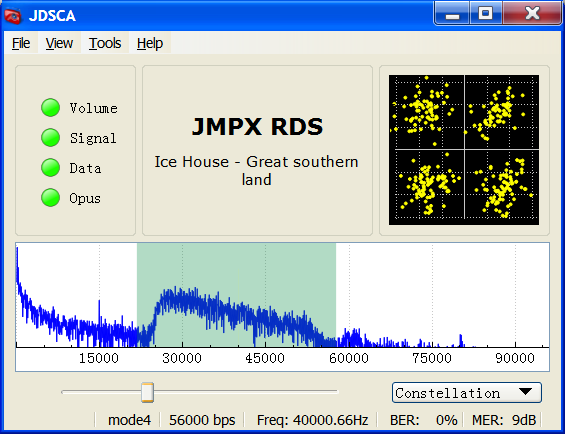

# JDSCA
DSCA demodulator and decoder written in C++ Qt

[JMPX] can encode and modulate DSCA signals.

## Binaries

Precompiled binaries can be downloaded from [Releases].

## Directory structure

The [DSCA](DSCA) directory is where the Qt pro file is for the main application.

## Compiling

Compiling requires the Qt framework which can be obtained from http://www.qt.io/download-open-source/ . Qt Creator can be used to compile JDSCA and comes with the Qt framework. At least version 5 of the Qt framework is required.

libopus and libcorrect are also required.

Jonti 2017
http://jontio.zapto.org

[OQPSK]: https://en.wikipedia.org/wiki/Phase-shift_keying#Offset_QPSK_.28OQPSK.29
[GMSK]: https://en.wikipedia.org/wiki/Minimum-shift_keying#Gaussian_minimum-shift_keying
[BPSK]: https://en.wikipedia.org/wiki/Phase-shift_keying#Binary_phase-shift_keying_.28BPSK.29
[UDP]: https://en.wikipedia.org/wiki/User_Datagram_Protocol
[SSB]: https://en.wikipedia.org/wiki/Single-sideband_modulation
[Arduino]: https://www.arduino.cc/
[Varicode]: https://en.wikipedia.org/wiki/Varicode
[Spectrum Lab]: http://www.qsl.net/dl4yhf/spectra1.html
[JMSK]: https://github.com/jontio/JMSK
[RTL-SDR]: http://www.rtl-sdr.com/about-rtl-sdr/
[Releases]: https://github.com/jontio/JDSCA/releases
[JMPX]: https://github.com/jontio/JMPX
